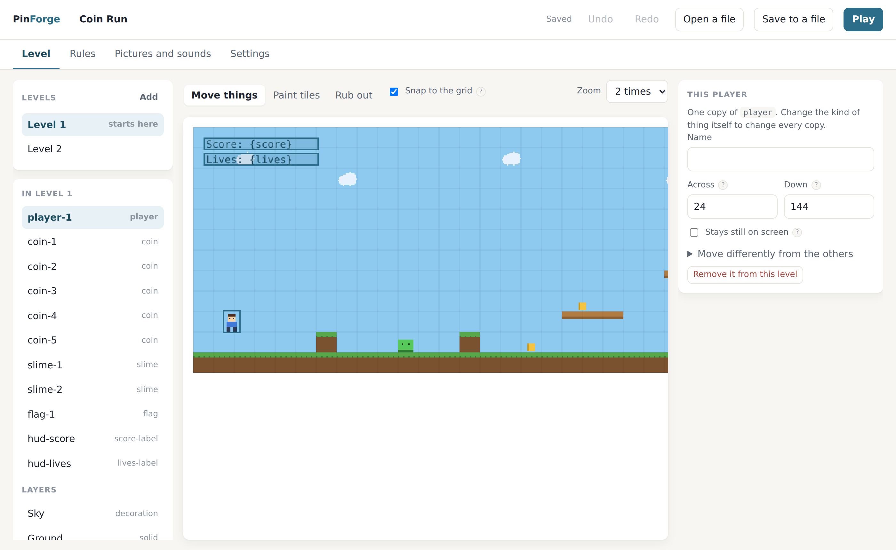

# Getting started

By the end of this you will have made a small platformer and turned it into a
single web page you can send to anyone. No programming, and no prior experience
with games. Expect half an hour.

## Open the editor

You need [Node](https://nodejs.org) 22 or newer. Once, in the PinForge folder:

```bash
pnpm install
pnpm --filter @pinforge/editor dev
```

Open the address it prints. You are looking at a game already: a player standing
on grass, three coins, two platforms and a score.



Press **Play**, top right. Arrow keys or WASD to move, space to jump, escape to
stop. That is a working game. Everything from here is changing it.

Your work is kept in the browser as you go, so closing the tab by accident costs
nothing. **Save to a file** when you want a copy you own.

## 1. Move things around

You are on the **Level** tab, with **Move things** selected. Drag the coins
somewhere else. Click one and the panel on the right shows exactly where it is.

Everything in the level is listed on the left, so nothing can hide behind
anything else.

## 2. Draw the level

Choose **Paint tiles**. A row of tiles appears, each with what it does written
underneath.

- **Solid** is ground and walls. Nothing walks through it.
- **One-way** is a wooden platform. You can jump up through it and land on top.
- **Hazard** is spikes. Touching them does nothing until you write a rule.

Paint some platforms. Use **Rub out** to take tiles away.

One thing worth knowing: a jump reaches about 46 pixels and a tile is 16, so
climb no more than two tiles at a time, and leave gaps of no more than three.

## 3. Make it feel the way you want

Click **Player** under *Kinds of thing* and look at *How it moves*.

Change **Jump height**. It is in pixels, so 60 is almost four tiles. Try 20, then
90, pressing Play each time. This is the part worth spending time on.

Under *How it feels* are three more settings, already set to good values: falling
faster than rising, a moment of grace after walking off a ledge, and remembering
a jump pressed just before landing. Those three are the difference between a
platformer that feels good and one that feels broken. You do not have to touch
them, and you have them anyway.

Anything changed on a *kind of thing* changes every copy of it, in every level. A
single copy can differ: select it in the level and open *Move differently from
the others*.

## 4. Write a rule

Go to the **Rules** tab. Each rule is a sentence:

> **WHEN** two things touch (player, coin) **THEN** play the sound, change a
> variable by, remove

Press **Change** on one to see how it is built: three dropdowns and a few fields.
Nothing is typed in a language.

Now make your own. Press **Add a rule**, then set it to:

- **WHEN** — When something touches a kind of tile
- Which thing: any Player. Tag: hazard
- **THEN** — Show the message `Ouch`, then add a second thing that happens:
  Restart the level

Press Play and walk into the spikes.

Two things the editor does quietly here. It only offers choices that make sense,
so it will not ask a coin whether it is standing on the ground, because coins
have no gravity. And a change that would leave the game broken is refused with a
sentence saying why, instead of producing a game that will not start.

Every trigger, condition and action is listed in
[the events reference](events-reference.md), and that is the whole language.

## 5. Get a whole thing at once

Rules one sentence at a time is how you learn the language, and it is a slow way
to get the ordinary furniture of a game in. Someone to talk to is six sentences
and a countdown once you know how; the first time, it is an afternoon.

So the editor keeps a few whole things ready. In the **Kinds of thing** panel,
open **Add something ready-made**:

- **Someone to talk to** — a character standing in the level. Walk into them and
  the game holds still while they say two lines, one press of your action key at
  a time. Nothing moves and no timer runs while they are talking.
- **An enemy that walks about** — walks back and forth on its own, turning at
  walls, and costs you the level if it catches you. In a game with gravity you
  can also land on it to squash it.
- **Something to collect** — disappears when you touch it and adds one to your
  score, making a `score` for you if the game has not got one.
- **A way to finish the level** — ends the level when you reach it, and takes you
  to the next one if there is one.

Each of these puts in the kind of thing, one copy of it in the level, and the
rules that make it work — all as one step you can undo. Then it tells you what
to change next.

They arrive wearing their own name — `Villager`, `Enemy` — rather than a picture,
so you can tell them apart before you have drawn anything. When you have art for
one, select it and press **Give it a picture instead**.

Go and read the rules a recipe wrote. They are ordinary sentences with nothing
special about them, and reading one is the fastest way to learn how a thing you
want is built.

## 6. Use your own pictures

**Pictures and sounds** takes PNG pictures and WAV or MP3 sounds. They are stored
inside the game file, so a game stays one thing you can move anywhere.

To use a picture for a character, add it here, then select a kind of thing and
choose it under *What it looks like*. Frame width and height are the size of one
frame, because one picture can hold a row of them; an animation is a list of
frame numbers and a speed.

To paint with a picture, press **Use as tiles** on it and say how big one tile is.

PinForge does not draw pictures or make sounds. It imports them, and gets on with
being a game engine.

## 7. Add a second level

Press **Add** next to *Levels*. Then finish the first level by sending the player
onward: a rule with **WHEN** two things touch (player, flag) **THEN** go to the
level.

Rules that should apply everywhere — losing a life, running out of lives, pausing
— belong under *Rules for the whole game* rather than copied into each level.

## 8. Share it

**Save to a file** gives you `my-game.pinforge.json`. That file is the whole game.

To turn it into a web page:

```bash
node packages/cli/dist/main.js export my-game.pinforge.json --out my-game.html
```

One file. The pictures and sounds are inside it, so there is nothing else to
upload and nothing to configure. Send it, put it on a web page, open it from a
memory stick.

## When something is wrong

The editor refuses changes that would break the game and says why, at the top of
the window. If you would rather edit the file by hand, the same checks are a
command away:

```bash
node packages/cli/dist/main.js validate my-game.pinforge.json
```

It answers in sentences, with the place in the file:

```
/scenes/0/layers/0/rows/2: Row 2 of the layer "ground" is 19 characters long,
but this level is 20 tiles wide.
```

## Where to go next

- [The concepts](concepts.md) — the ideas rather than the buttons.
- [The project format](project-format.md) — what is inside the file, if you would
  rather type than click.
- [The MCP server](mcp.md) — building a game with an assistant.
- `examples/first-game` — two finished levels with a patrolling enemy, spikes and
  a flag. Open it in the editor with **Open a file**.
